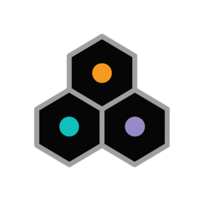

# nix-agentic-tools

Stacked commit workflows, MCP servers, and declarative configuration for
AI coding CLIs. Works without Nix; Nix unlocks overlays, home-manager
modules, and devshell integration.

## What's Inside

**Stacked workflow skills** — 6 SKILL.md files for stacked commit
workflows using git-branchless, git-absorb, and git-revise. Work with
Claude Code, Copilot, and Kiro.

**MCP server packages** — 14 Model Context Protocol servers packaged as
Nix derivations with typed settings and credential handling.

**Home-manager modules** — Declarative configuration for Claude Code,
Copilot CLI, Kiro CLI, stacked workflows, and MCP services.

**DevEnv modules** — Per-project AI tool configuration without
home-manager.

**Content packages** — Reusable coding standards and stacked workflow
content as composable Nix derivations.

## Supported CLIs

{{#include ./generated/snippets/cli-table.md}}

## Quick Links

- **New here?** Start with [Choose Your Path](./getting-started/choose-your-path.md)
- **Have Nix + home-manager?** Jump to [Home-Manager Setup](./getting-started/home-manager.md)
- **Want per-project config?** See [DevEnv Setup](./getting-started/devenv.md)
- **Just want the skills?** Copy `packages/stacked-workflows/skills/stack-*` into your project
- **Browse all options?** Use the [interactive options search](./options/)
